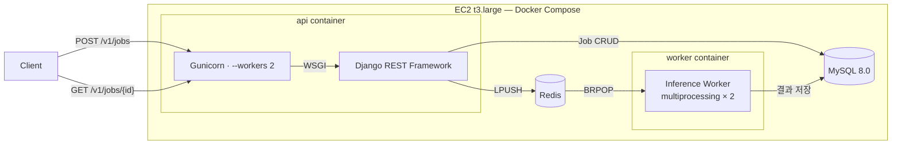
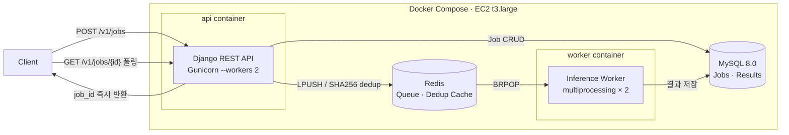
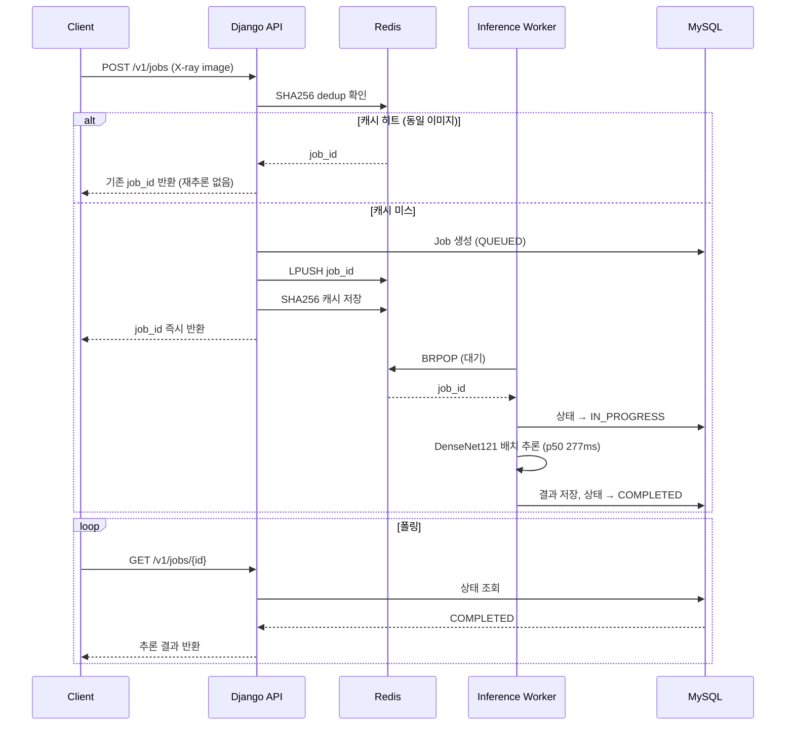
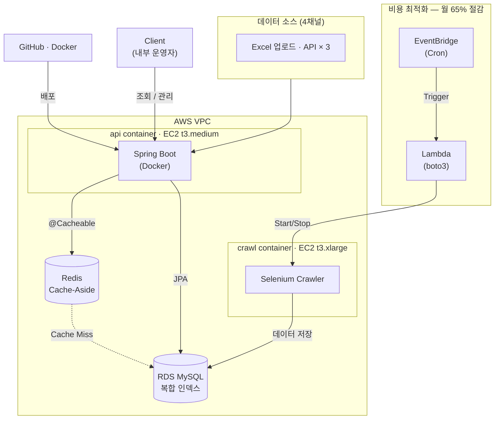

# 흉부 X-ray AI 추론 서빙 시스템

흉부 X-ray 이미지를 받아 18가지 병리(폐렴, 흉수, 기흉 등)의 확률을 반환하는 추론 API 서버.
외부 병원에 X-ray AI 분석 기능을 제공하는 API 서비스 구조로 설계했다.
Gunicorn 기반 동기 WSGI 서버이며, 추론 요청은 Redis 큐를 통해 별도 워커 프로세스에서 처리된다.
클라이언트는 요청 즉시 `job_id`를 받고 폴링으로 결과를 확인하는 **큐 기반 작업 분리 구조**다.

---

## 프로젝트 배경

AI 모델을 API 서버에서 직접 호출하면 CPU-bound 작업이 Gunicorn worker 프로세스를 점유하여
동시에 다른 요청을 처리할 수 없다. 흉부 X-ray 추론은 CPU 기준 약 277ms가 걸린다.
workers 2개가 모두 추론 요청을 받으면 새 요청이 대기 상태로 누적된다.
여기에 Redis 큐와 별도 워커 프로세스를 도입해 API 응답성과 추론 처리를 분리했다.

---

## 아키텍처

### 시스템 아키텍처

### 컴포넌트 구성

### 요청 흐름

**API 서버와 워커를 분리한 이유**: PyTorch 추론은 CPU-bound 작업이라
같은 프로세스에서 실행하면 다른 요청을 처리할 수 없다.
별도 프로세스로 분리해 API 서버가 요청 수신에만 집중하게 했다.

---

## 핵심 문제 해결 과정

### 1. 같은 이미지가 반복 요청될 때 매번 추론해야 하나?

**문제**: 클라이언트 재전송, 네트워크 재시도, 동일 이미지 반복 업로드 등으로 같은 이미지가
중복 요청될 수 있다. 매번 277ms짜리 추론을 실행하는 건 불필요한 리소스 낭비다.

**해결**: 이미지 bytes의 SHA256 해시를 Redis 캐시 키로 사용.
동일 이미지의 두 번째 요청부터는 추론 없이 기존 결과를 바로 반환한다.

**결과 (EC2 t3.large, 동시 10명 부하 테스트)**:

| 시나리오                       | p50     | p95     |
| ------------------------------ | ------- | ------- |
| 첫 요청 (추론 발생)            | 1,100ms | 2,800ms |
| 동일 이미지 재요청 (캐시 히트) | 68ms    | 230ms   |

캐시 히트 시 **16배** 빠른 응답. 동시 20명에서는 캐시 미스 p50=6,000ms, 캐시 히트 p50=110ms(**54배 차이**).

**한계**: Redis TTL(10분) 만료 후 동일 이미지 재요청 시 DB에 기존 결과가 있어도 재추론이 발생한다.
cache miss 시 `InferenceJob.objects.filter(input_sha256=sha256)` DB 조회를 fallback으로 추가하거나,
Redis 캐싱을 제거하고 DB 직접 조회로 단순화하는 것이 더 정확한 설계다.

---

### 2. 여러 요청이 몰릴 때 추론 효율을 높이려면?

**문제**: 워커가 Redis 큐에서 job을 하나씩 꺼내 처리하면,
요청이 몰릴 때 모델 forward pass가 N번 반복된다.

**해결**: 30ms 배치 윈도우(micro-batching) 도입.
첫 번째 job을 BRPOP으로 기다린 뒤, 30ms 동안 추가 job을 더 모아서 한 번의 forward pass로 처리한다.

**30ms로 정한 근거**: EC2 기준 단일 추론 p50=277ms.
30ms 대기는 그 약 11%(30÷277ms) 수준으로, latency를 크게 희생하지 않으면서 burst 요청을 묶을 수 있다.

**CPU vs GPU에서의 효과 차이**:

- CPU (현재 환경): 배치 latency가 선형 증가 (bs=1→272ms, bs=8→2,073ms).
  forward pass가 지배적이라 GPU와 달리 throughput 이득은 없다.
  실질 효과는 N개 job의 상태 전환(QUEUED→IN_PROGRESS)을 `filter().update()` 단일 쿼리로 처리하는 DB 오버헤드 절감.
- GPU (향후 전환 시): 행렬 연산 병렬화로 배치 크기 증가 시 throughput이 선형 이상으로 증가.
  코드는 `INFERENCE_DEVICE` 환경변수로 GPU 전환이 가능하도록 device-agnostic하게 작성되어 있다.

---

### 3. 추론 속도를 더 높이려고 ONNX를 시도했으나 실패

**문제**: PyTorch 모델을 ONNX로 변환하면 ONNX Runtime으로 더 빠르게 추론할 수 있다는 가설.

**조사**: `densenet121-res224-all`은 7개 데이터셋을 앙상블하는 구조다.
각 데이터셋별로 해당하는 pathology만 선택하는 과정에서 `NonZero` 연산이 사용되는데,
이 연산의 출력 크기가 입력 데이터에 따라 달라진다(data-dependent output shape).
ONNX는 정적 계산 그래프만 지원하므로 이 부분에서 변환이 실패한다.

`onnx` 라이브러리로 계산 그래프를 직접 분석해 `Reshape_2` 노드에서
`Input shape:{11}, requested shape:{}` 불일치가 근본 원인임을 확인했다
(batch=1 기준; NonZero가 export 시 dummy input에서 0개, 실제 이미지 추론 시 11개를 반환해 shape 불일치 발생).

**결론**: ONNX 변환 자체는 성공하지만 실제 추론 시 위 에러가 발생해 적용 불가.
이는 모델 아키텍처의 근본적인 제약으로, 단일 데이터셋 모델로 교체하지 않는 한 우회 방법이 없다.

---

### 4. 워커가 죽으면 처리 중인 Job은 어떻게 되나?

**문제**: Redis BRPOP은 메시지를 꺼내는 순간 큐에서 삭제된다.
처리 완료를 보장하는 ACK가 없어, 워커 프로세스가 추론 중 SIGKILL을 받으면
Job이 `IN_PROGRESS` 상태로 영원히 남는다.

**해결**: Manager 프로세스가 10분마다 `_recover_stuck_jobs()`를 실행.
- 10분 이상 `IN_PROGRESS`인 Job → `QUEUED`로 되돌리고 재큐잉
- 5분 이상 `QUEUED`인 Job → enqueue 유실로 판단, 재큐잉
  (정상 처리는 수초 이내 — 5분 경과는 enqueue 누락으로 판단)

**재시도 및 DLQ**:
- Redis `INCR`으로 재시도 횟수 관리 (`retry:{job_id}`, TTL 1시간)
- 3회 재시도 초과 시 `FAILED` 처리 후 Dead Letter Queue에 보관 (`/v1/ops/dlq`로 운영자 확인)

**Celery와의 비교**: Celery는 `acks_late=True` 설정으로 이 문제를 자동으로 처리한다.
직접 구현했기 때문에 이 약점을 보완해야 했고, DB 상태를 기준으로 큐와 DB 간 불일치를
주기적으로 감지·복구하는 패턴을 직접 구현했다.

---

## API

| Method | Endpoint               | 설명                                                      |
| ------ | ---------------------- | --------------------------------------------------------- |
| POST   | `/v1/jobs`             | X-ray 이미지 업로드, 추론 Job 생성                        |
| GET    | `/v1/jobs/{id}`        | Job 상태 조회 (QUEUED / IN_PROGRESS / COMPLETED / FAILED) |
| GET    | `/v1/jobs/{id}/result` | 추론 결과 (18개 병리 확률 + top_label)                    |
| GET    | `/v1/ops/metrics`      | 최근 5분 처리량, 실패율, end-to-end latency (p50/p95/p99) |
| GET    | `/v1/ops/dlq`          | 재시도 초과 후 최종 실패한 Job 목록                       |
| GET    | `/v1/ops/health`       | DB + Redis 연결 상태 확인 (로드밸런서용)                  |

---

## 성능 수치 (EC2 t3.large, CPU-only, 실측)

**단일 추론** (50회 반복):

| p50   | p95   | p99   |
| ----- | ----- | ----- |
| 277ms | 304ms | 318ms |

**부하 테스트** (Locust, 동시 10명):

| 시나리오                       | p50     | p95     | 실패율 |
| ------------------------------ | ------- | ------- | ------ |
| 캐시 미스 (첫 요청)            | 1,100ms | 2,800ms | 0%     |
| 캐시 히트 (동일 이미지 재요청) | 68ms    | 230ms   | 0%     |

> `end_to_end_latency_seconds` (`/v1/ops/metrics` 응답값)는 API 수신부터
> 결과 저장까지의 전체 시간으로, 큐 대기시간도 포함된다.
> 단순 추론 시간(277ms)과 다른 지표임에 주의.

---

## 기술 스택

| 역할      | 기술                                  | 선택 이유                                                                                     |
| --------- | ------------------------------------- | --------------------------------------------------------------------------------------------- |
| API 서버  | Django REST Framework + Gunicorn      | ORM + 시리얼라이저로 빠른 개발; Gunicorn `--workers 2` (vCPU 2개, 추론 워커와 리소스 공유 고려) |
| 큐        | Redis LPUSH/BRPOP                     | 단일 태스크(X-ray 추론) 구조에서 Celery의 태스크 라우팅·직렬화 레이어가 불필요하다고 판단. 큐·워커 흐름을 직접 구현하며 내부 동작 학습 (실무에서는 Celery 사용 권장) |
| 추론 모델 | PyTorch + torchxrayvision DenseNet121 | Apache-2.0, 흉부 X-ray 특화, HuggingFace 자동 캐싱                                            |
| DB        | MySQL 8.0                             | Job 상태·결과 영속성 보장, 복합 인덱스 지원                                                   |
| 인프라    | Docker Compose + AWS EC2              | 로컬과 서버 환경 동일하게 재현 가능                                                           |
| CI/CD     | GitHub Actions                        | push → pytest → EC2 자동 배포                                                                 |
| 테스트    | pytest-django (SQLite in-memory)      | MySQL 없이 26개 단위 테스트 실행                                                               |

---

## 현재 한계 및 개선 방향

의도적으로 범위 밖에 둔 것과 다음 단계로 개선 가능한 것들:

- **인증/인가 없음**: 현재 누구나 API를 호출할 수 있다. 실서비스라면 API Key 또는 JWT를 붙여야 한다.
- **Rate limiting 정확도**: DRF의 `AnonRateThrottle`은 Gunicorn worker 프로세스별로 독립된 메모리를 사용한다. Worker 수가 늘면 실질적인 제한이 느슨해진다. Redis 기반 캐시 백엔드로 전환하면 해결된다.
- **SHA256 캐시 한계**: Redis TTL(10분) 만료 후 동일 이미지 재요청 시 DB에 기존 결과가 있어도 재추론이 발생한다. DB 직접 조회(`filter(input_sha256=sha256)`)로 대체하는 것이 더 단순하고 정확한 설계다.
- **중복 요청 race condition**: SHA256 캐시 미스 직후 동시 요청이 오면 드물게 중복 Job이 생길 수 있다. DB unique constraint + `get_or_create`가 더 정확한 해결책이다.

---

<!-- TODO: 스크린샷 후 삭제 -->

## 전사 통합 상품 관리 플랫폼 — 시스템 아키텍처

