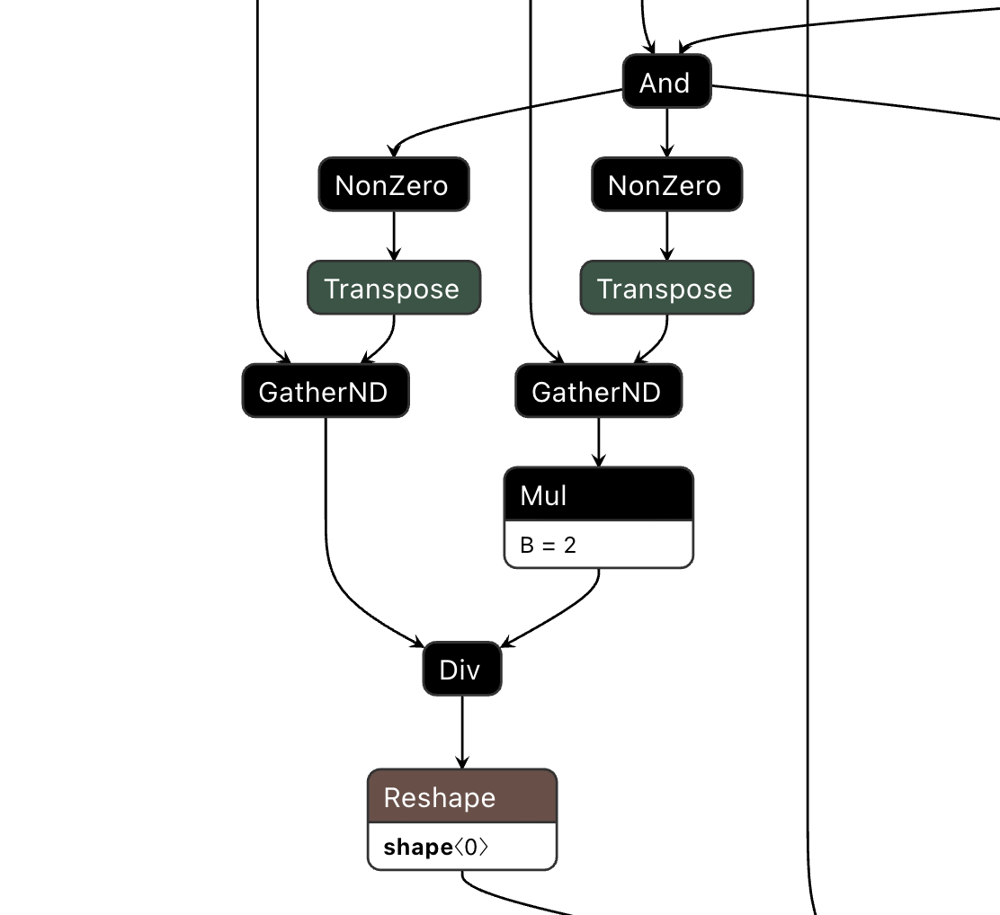

# ADR-003: ONNX Runtime 최적화 시도 및 적용 불가 판정

- **상태**: 검토 후 기각
- **날짜**: 2026-02

## 배경

PyTorch 추론 속도 개선을 위해 ONNX Runtime 적용을 시도했다. ONNX Runtime은 CPU 환경에서 PyTorch 대비 1.5~2x 속도 향상이 보고된 경우가 있어 검토 대상이 됐다.

## 시도

`torch.onnx.export`로 `densenet121-res224-all` 모델을 ONNX 포맷으로 변환했다. 변환 자체는 성공했으나, 실제 추론 시 아래 에러가 발생했다.

```
Non-zero status code returned while running Reshape node /Reshape_2.
Input shape:{11}, requested shape:{}
```

에러 원인을 파악하기 위해 Netron(ONNX 모델 시각화 도구)으로 변환된 그래프를 직접 확인했다. 에러가 발생한 `Reshape_2` 노드를 클릭해 상위 노드를 따라가며 근본 원인을 확인했다.


## 근본 원인

`Reshape_2` 노드 인근의 연산 순서: `And → NonZero → Transpose → GatherND → Div → Reshape_2`

`NonZero`는 입력 텐서에서 0이 아닌 원소의 인덱스를 반환하는 연산이다. 출력 크기가 런타임 입력값에 따라 달라지는 **data-dependent output shape** 특성을 갖는다.

`densenet121-res224-all`은 NIH, PadChest, CheXpert 등 7개 데이터셋을 앙상블한 모델이다. 각 병리(pathology)에 대해 "어떤 데이터셋이 해당 병리 레이블을 포함하는가"를 `NonZero`로 동적으로 검색한 뒤 `GatherND`로 집계한다. 이 구조는 데이터셋 조합에 따라 shape이 달라지도록 설계되어 있다.

ONNX는 정적 계산 그래프(static computation graph)만 지원한다. export 시 dummy input(zero tensor)으로 실행하면 `NonZero`가 0개를 반환해 shape이 `[]`(스칼라)로 고정된다. 실제 추론 시 `NonZero`가 11개(batch=1 기준)를 반환하면 `Reshape([11], [])` 연산이 불가능해 런타임 에러가 발생한다.

## 결정

ONNX Runtime 적용하지 않는다. 이는 모델 아키텍처의 근본적인 제약으로, 우회 방법이 없다. 단일 데이터셋 모델로 교체하면 적용 가능하나, 18개 병리를 모두 커버하는 앙상블 모델의 이점을 포기해야 한다.

## 결과

- ONNX 적용 불가 사실을 benchmark.py에서 명시적으로 출력하도록 처리
- `workers/onnx_loader.py`는 분석 과정에서 작성한 코드로 보존. `INFERENCE_ENGINE=onnx` 환경변수로 전환 가능한 구조를 유지해, 단일 데이터셋 모델(예: densenet121-res224-nih)로 교체 시 재활용 가능
- 향후 단일 데이터셋 모델로 전환 시 재검토 가능
